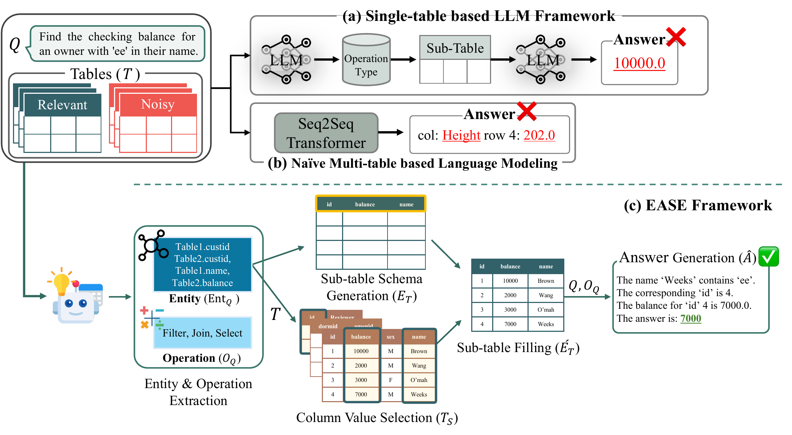

<div align="center">

# 📑 EASE

### Entity-Aware Sub-table Generation for Real-world Multi-table QA

[-8A2BE2.svg)](https://aclanthology.org/2026.acl-long.10/)
[](https://aclanthology.org/2026.acl-long.10.pdf)
[](https://www.python.org/)



<b>Official implementation and dataset of the <a href="https://aclanthology.org/2026.acl-long.10/">ACL 2026</a> paper.</b>

<b><a href="https://aclanthology.org/2026.acl-long.10.pdf">📄 Paper</a> · <a href="#overview">✨ Overview</a> · <a href="#installation">⚙️ Installation</a> · <a href="#usage">🚀 Usage</a> · <a href="#dataset">📚 Dataset</a> · <a href="#results">📊 Results</a> · <a href="#citation">📌 Citation</a></b>

</div>

---

## Overview

**EASE** is an LLM-based framework for real-world table QA, where the input is a set of tables that mixes query-relevant tables with noisy, irrelevant ones. Instead of reasoning over the whole noisy table set, EASE builds an entity-aware sub-table and answers from it in five modules:

1. **Entity & Operation Extraction** · From the question and the top-3 rows of each table, extract `Table.Column` entities and the operations needed (select, count, sum, group, ...).
2. **Sub-table Schema Generation** · Generate an empty markdown table whose columns are the extracted entities.
3. **Column Value Selection** · Symbolically (pandas) select only the entity columns from the input tables, dropping noisy tables and irrelevant columns.
4. **Sub-table Filling** · Fill the schema with the selected column values.
5. **Answer Generation** · Reason step by step over the filled sub-table and the extracted operations to produce the final answer.

We also release the **Noisy Multi-table QA** dataset, built by injecting randomly sampled or contextually similar noisy tables into [MultiTabQA](https://github.com/kolk/MultiTabQA). EASE filters out irrelevant information while keeping the values needed for the answer, achieving the best Substring EM and Table-F1 with GPT-4o in both noise settings and cutting the input table size by more than 80% compared with baselines.


## What's in this repository

```
EASE.py            EASE inference pipeline (five modules)
prompts.py         prompt templates for each module
shot_examples.py   few-shot examples for Entity & Operation Extraction
eval_by_case.py    evaluation: chrF, Substring EM, Table-F1
configs/           inference configs (gpt4o, claude3.5)
assets/            figure
eval_configs/      evaluation configs (gpt4o, claude3.5)
data/              Noisy Multi-table QA dataset
```

## Installation

Tested with Python 3.9. Pinned package versions are listed in `requirements.txt`.

```bash
git clone https://github.com/Metalchaos8527/ease_noisy_multi-table_qa.git && cd ease_noisy_multi-table_qa
pip install -r requirements.txt
```

EASE calls OpenAI or Anthropic models through LangChain. Set the API key for the backbone you use:

```bash
export OPENAI_API_KEY="your-openai-api-key"
export ANTHROPIC_API_KEY="your-anthropic-api-key"   # for Claude
```

You can also put the key in the `openai_api_key` / `anthropic_api_key` field of a config file.

## Usage

### Inference

```bash
python EASE.py --config_file gpt4o/EASE_randomly_sampled
python EASE.py --config_file gpt4o/EASE_contextually_sampled
python EASE.py --config_file claude3.5/EASE_randomly_sampled
```

`--config_file` is resolved relative to `configs/`. The provided configs reproduce the paper setting: GPT-4o (`gpt-4o-2024-08-06`) and Claude 3.5 Haiku (`claude-3-5-haiku-20241022`) with temperature 0.3 and top-p 1.0. A config sets the backbone model, the dataset path and generation hyperparameters:

```json
{
    "openai_model": "gpt-4o-2024-08-06",
    "data_dir": "./data/final_data/randomly_sampled.json",
    "save_dir": "./output/",
    "save_name": "EASE_gpt4o_randomly_sampled.json",
    "max_tokens": 16383,
    "temperature": 0.3,
    "batch_size": 4,
    "seed": 144
}
```

Predictions are written to `save_dir/save_name`. Each instance keeps the output of every module (`entities`, `empty_tables`, `table_fillings`, `answer`), so intermediate reasoning can be inspected.

### Evaluation

```bash
python eval_by_case.py --config_file gpt4o/EASE_randomly_sampled
python eval_by_case.py --config_file gpt4o/EASE_contextually_sampled
```

`--config_file` is resolved relative to `eval_configs/`. The evaluator takes the text after `Final Answer:` in each prediction and reports three metrics against `short_answer`:

- **chrF** · character n-gram F-score.
- **Substring EM** · whether the ground truth appears as a substring of the prediction, with partial credit for comma-separated multi-item answers.
- **Table-F1** · precision and recall of the table values in the prediction with respect to the ground truth, after filtering out substrings that do not come from table values.

Per-instance scores are saved to `result/<prediction file>_eval.json`.

## Dataset

The Noisy Multi-table QA dataset is derived from [MultiTabQA](https://github.com/kolk/MultiTabQA). Every instance contains 4 input tables: 1 to 3 query-relevant tables and the rest injected noisy tables. Gold answers are converted from tabular form to free-form text.

| File | # instances | Noise injection |
|---|---|---|
| `data/final_data/randomly_sampled.json` | 300 | randomly sampled from the candidate table pool |
| `data/final_data/contextually_sampled.json` | 300 | contextually similar tables selected by embedding cosine similarity |

Each integrated file is the concatenation of three 100-instance splits by the number of relevant tables, also provided separately as `data/random/random_table{1,2,3}.json` and `data/embed/embed_table{1,2,3}.json`.

An instance looks like:

```json
{
  "question": "What are the names of everybody who has exactly one friend?",
  "table_names": ["PersonFriend"],
  "tables": [{"columns": ["name", "friend", "year"], "index": [0, 1, 2, 3], "data": [["Alice", "Bob", 2004], "..."]}],
  "noise_table_names": ["wrestler", "employees", "Employees"],
  "noise_tables": ["..."],
  "short_answer": "Alice, Bob",
  "long_answer": "The names of everybody who has exactly one friend are Alice and Bob."
}
```

`tables` and `noise_tables` are pandas `split`-oriented table dicts. `short_answer` is the evaluation reference; `query` (the source SQL) and the original tabular `answer` are kept as well.

## Results

GPT-4o results on the Noisy Multi-table QA dataset (Tables 1 and 2 of the paper). EASE achieves the best Substring EM and Table-F1 in both noise settings.

**Randomly sampled noise injection**

| Method | chrF | Substring EM | Table-F1 |
|---|---|---|---|
| Zero-Shot | 54.77 | 43.15 | 57.20 |
| Few-Shot | 56.38 | 55.12 | 57.80 |
| Chain-of-Thought | 60.12 | 48.33 | 64.73 |
| Chain-of-Table | 35.54 | 39.90 | 39.76 |
| **EASE** | **63.80** | **66.02** | **69.65** |

**Contextually sampled noise injection**

| Method | chrF | Substring EM | Table-F1 |
|---|---|---|---|
| Zero-Shot | 52.87 | 41.64 | 55.86 |
| Few-Shot | 54.20 | 53.97 | 56.54 |
| Chain-of-Thought | 56.52 | 44.85 | 60.66 |
| Chain-of-Table | 32.80 | 48.06 | 46.83 |
| **EASE** | **59.43** | **62.06** | **65.68** |

See the [paper](https://aclanthology.org/2026.acl-long.10/) for the full comparison, including TableLLaMA, MultiTabQA, DATER and H-STAR, the ablation of each module, and the efficiency analysis.

## Citation

```bibtex
@inproceedings{kang-etal-2026-ease,
    title = "{EASE}: Entity-Aware Sub-table Generation for Real-world Multi-table {QA}",
    author = "Kang, Myunghoon  and
      Jung, Dahyun  and
      Son, Suhyune  and
      Koo, Seonmin  and
      Chun, Changwoo  and
      Rim, Daniel  and
      Kwon, Haeyoung  and
      Hur, Yuna  and
      Lim, Heuiseok",
    editor = "Liakata, Maria  and
      Moreira, Viviane P.  and
      Zhang, Jiajun  and
      Jurgens, David",
    booktitle = "Proceedings of the 64th Annual Meeting of the {A}ssociation for {C}omputational {L}inguistics (Volume 1: Long Papers)",
    month = jul,
    year = "2026",
    address = "San Diego, California, United States",
    publisher = "Association for Computational Linguistics",
    url = "https://aclanthology.org/2026.acl-long.10/",
    doi = "10.18653/v1/2026.acl-long.10",
    pages = "277--302",
    ISBN = "979-8-89176-390-6"
}
```
